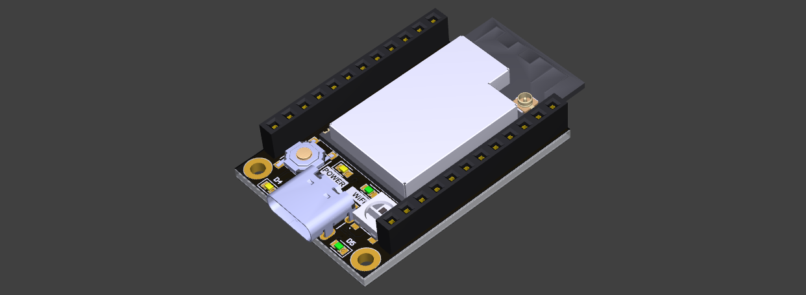

<h1 align="center">
  <a></a>
  <br>
  Título
</h1>

<p align="center">
  <b>Subtítulo</b>
</p>

---

## Tabla de contenido <!-- omit in toc -->
- [Descripción](#descripción)
- [Uso de librería](#uso-de-librería)
  - [Inicialización](#inicialización)

---

## Descripción
Esta librería permite...

## Uso de librería
A continuación, se muestran algunos ejemplos...

### Inicialización
```cpp
// Crear objeto
Example example;

void setup() {
  // Inicializar
  example.begin();
}
```